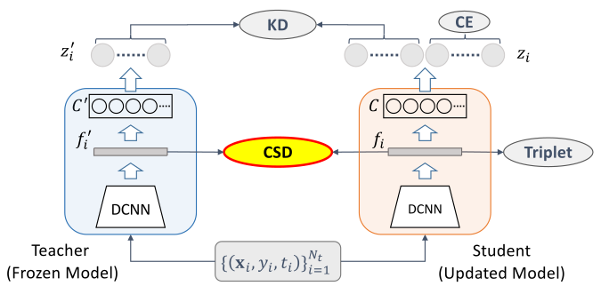

# Contrastive Supervised Distillation for Continual Representation Learning

This repo contains the code of "Contrastive Supervised Distillation for Continual Representation Learning",
_Tommaso Barletti, Niccolò Biondi, Federico Pernici, Matteo Bruni, and Alberto Del Bimbo_. (Pusblished as Oral at ICIAP 2021)

Tommaso Barletti and Niccolò Biondi contributed equally.

This work has been awarded as Best Student Paper at ICIAP21

## Abstract

<p align="center">
  
</p>

> In this paper, we propose a novel training procedure for the continual representation learning problem 
> in which a neural network model is sequentially learned to alleviate catastrophic forgetting in visual 
> search tasks. Our method, called Contrastive Supervised Distillation (CSD), reduces feature forgetting
> while learning discriminative features. This is achieved by leveraging labels information in a 
> distillation setting in which the student model is contrastively learned from the teacher model. 
> Extensive experiments show that CSD performs favorably in mitigating catastrophic forgetting by 
> outperforming current state-of-the-art methods. Our results also provide further evidence that feature
> forgetting evaluated in visual retrieval tasks is not as catastrophic as in classification tasks.


## Install and Train

Install the repo and the required dependencies and train with default parameters
```shell
git clone https://github.com/NiccoBiondi/ContrastiveSupervisedDistillation
cd ContrastiveSupervisedDistillation
pip install -r requirements.txt
# train with default parameters
python train.py
```

### Train with Docker
```shell
cd ContrastiveSupervisedDistillation
# build the container first
docker build -t csd:csd -t csd:latest .
# train within the container
bash ./train_container.sh
```


## Authors

- Tommaso Barletti <tommaso.barletti (at) gmail.com>
- Niccolò Biondi <niccolo.biondi (at) unifi.it>[](https://github.com/NiccoBiondi)
- Federico Pernici <federico.pernici (at) unifi.it> [](https://twitter.com/FedPernici)
- Matteo Bruni <matteo.bruni (at) unifi.it>[](https://github.com/matteo-bruni)
- Alberto Del Bimbo <alberto.delbimbo (at) unifi.it>

## Citing

Please kindly cite our paper if this repository is helpful.

```
@ARTICLE{barletti2022contrastive,
  author={Barletti, Tommaso and Biondi, Niccolo and Pernici, Federico and Bruni, Matteo and Bimbo, Alberto Del},
  journal={21st International Conference on Image Analysis and processing}, 
  title={Contrastive Supervised Distillation for Continual Representation Learning}, 
  year={2021},
  volume={},
  number={},
  pages={1-12},
}
```
